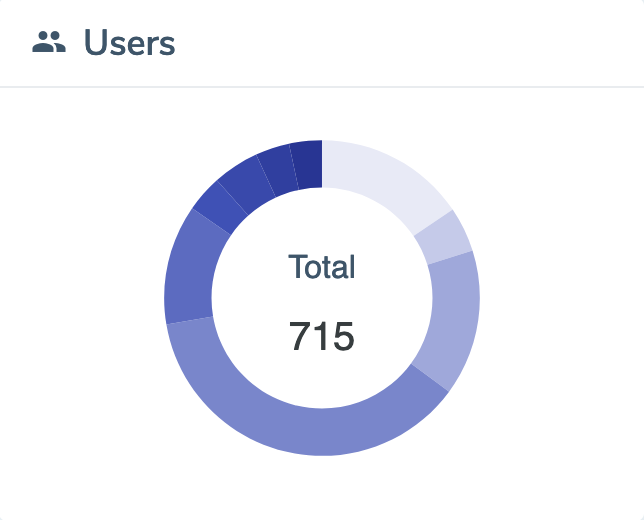

# HackyEaster2021

## Thank You
First, a big thank you to the volunteers (daubsi, khae, otaku), and all supporters that bought a Ko-Fi!

## Write-Ups
The following write-ups have been written (contact me at hackyeaster@gmail.com if you want yours to be added):
- [vernjan (GitHub)](https://github.com/vernjan/ctf-writeups/blob/master/write-ups/HackyEaster2021/README.md)
- [scryh (devel0pment.de)](https://devel0pment.de/?cat=7)
- [TobjasR (GitHub)](https://github.com/TobjasR/he2021/)

## Ph1n1sh3rs (ordered by time)
The following players have beaten all levels and got rewarded with a "Ph1n1sh3r" badge. Congats!

darkice, darkstar, daubsi, DrSchottky, scryh, novak, explo1t, keep3r, evandrix, ptu, m4ttm00ny, SmartSmurf, khae, EngyCZ, Adib3r, vernjan, fix86, brp64, Mitsch, xdjibi, Nezzarll, AstroViking, TobjasR, Robbe7730

## Top 10

## Stats
### Players
| players | count |
| :- | -: |
| perfect solvers | 20 |
| ph1n1sh3r (level 9) | 24 |
| level 8 | 25 |
| level 7 | 34 |
| level 6 | 27 |
| level 5 | 88 |
| level 4 | 266 |
| level 3 | 107 |
| level 2 | 33 |
| level 1 | 111 |
| **total** | 715 |

### Solves
| solves | count |
| :- | -: |
| noob | 2322 |
| easy | 2550 |
| medium | 815 |
| hard | 358 |
| **total** | 6045 |

